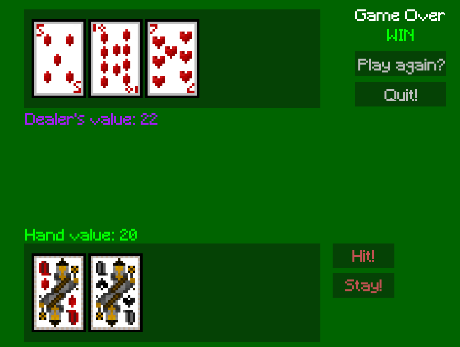

# PyBJ - Blackjack in Python!

Thank's for checking out my game! It's an implementation of Blackjack built in Python using PyGame. It *attempts* to use MVC architecture. As of now, this isn't a spectacular piece of programming artistry -- but I hope to work on it and potentially add more games, features, etc. Who knows, one day it might be pretty good!

## Assets
[The Ultimate Game Comopnent Kit by Rad Potato](https://rad-potato.itch.io/pixel-perfect-ultimate-game-component-kit)

  

